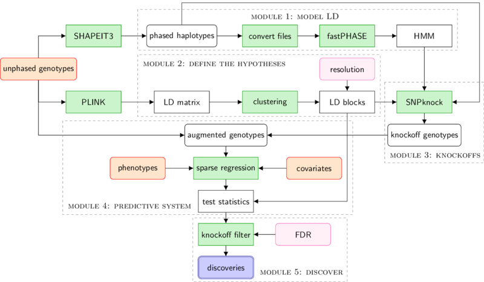

# KnockoffZoom

A powerful and versatile statistical method for the analysis of genome-wide association data.

## Overview

The goal of *KnockoffZoom* is to identify causal variants for complex traits effectively and precisely through genome-wide fine-mapping, accounting for linkage disequilibrium and controlling the false discovery rate.
The results leverage the genetic models used for phasing and are equally valid for quantitative and binary traits. For more information, read the accompanying paper.

The code contained in this repository is designed to allow the application of *KnockoffZoom* to large datasets, such as the [UK Biobank](https://www.ukbiobank.ac.uk/).
Some of the code is provided in the form of Bash and R scripts, while the core algorithms for Monte Carlo knockoff sampling are implemented in the R package [SNPknock](https://bitbucket.org/msesia/snpknock), which should be installed separately.

The *KnockoffZoom* methodology is divided into different modules, each corresponding to a separate Bash script, as summarized in the following flowchart.

## Toy dataset

A toy dataset containing 1000 artificial samples typed at 2000 loci (divided between chromosome 21 and 22) is offered as an example in which the *KnockoffZoom* analysis can be carried out on a laptop with a single click. To run the example, install the software dependencies listed below and execute the script `analyze.sh`. The analysis should take approximately 5 minutes on a personal computer. The results can be visualized interactively with the script `visualize.sh`, which will launch a [Shiny](https://shiny.rstudio.com/) app in your browser.

## Real applications

*KnockoffZoom* is computationally efficient and we have successfully applied it to the analysis of the genetic data in the UK Biobank. The computational resources required for this task are summarized in the accompanying paper. 
The modular nature of our method allows the code contained in each of the 5 main scripts to be easily deployed on a computing cluster for large-scale applications. This task will require some additional user effort compared to the toy example, but the scripts for each module are documented and quite intuitive.

## Software dependencies

The following software should be available from your Unix path:

   - [PLINK 1.9](https://www.cog-genomics.org/plink/1.9/)
   - [PLINK 2.0](https://www.cog-genomics.org/plink/2.0/) alpha
   - [fastPHASE](http://scheet.org/software.html) 1.4.8
   - [GNU datamash](https://www.gnu.org/software/datamash/) 1.3
   - [GNU awk](https://github.com/onetrueawk/awk) 4.0.2

The [R](https://www.r-project.org/) (version 3.5.1) code was tested on the following configuration:

   - [SNPknock](https://bitbucket.org/msesia/snpknock) 0.8.0
   - [adjclust](https://CRAN.R-project.org/package=adjclust ) 0.5.6
   - [bigsnpr](https://privefl.github.io/bigsnpr/) 0.9.1
   - [bigstatsr](https://privefl.github.io/bigstatsr/) 0.8.4
   - [snpStats](https://doi.org/doi:10.18129/B9.bioc.snpStats) 1.32
   - [Matrix](https://CRAN.R-project.org/package=Matrix ) 1.2.15
   - [data.table](https://CRAN.R-project.org/package=data.table) 1.12.0
   - [tidyverse](https://www.tidyverse.org/) 1.2.1
   - [devtools](https://CRAN.R-project.org/package=devtools) 1.13.6

## Authors

   - [Matteo Sesia](http://web.stanford.edu/~msesia/) (Stanford University).

## Contributors

   - [Eugene Katsevich](http://web.stanford.edu/~ekatsevi/) (Stanford University). User interface of the Shiny visualization app.

## License

This software is distributed under the [GPLv3 license](https://www.gnu.org/licenses/gpl-3.0.en.html) and it comes with ABSOLUTELY NO WARRANTY.

## Further references

Read more about the broader framework of [knockoffs](https://web.stanford.edu/group/candes/knockoffs/).
