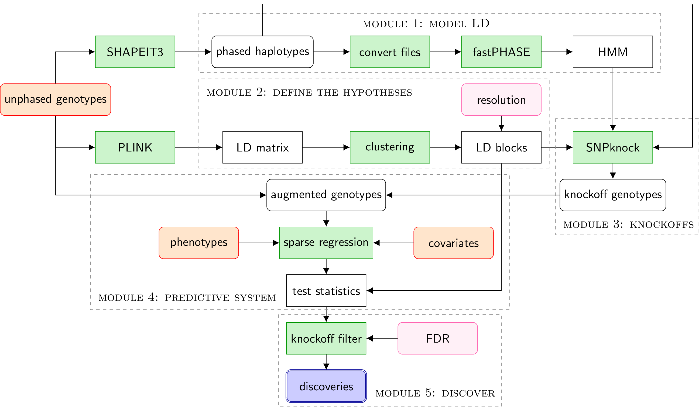

The *KnockoffZoom* methodology is divided into different modules, as summarized in the following flowchart.
The code is available from the <a href="https://github.com/msesia/knockoffzoom" target="_blank">GitHub repository</a>.

