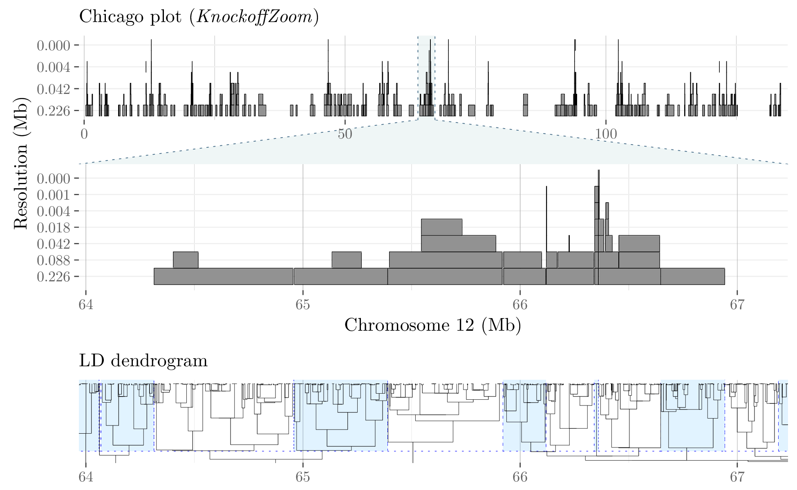

<head>
<!-- Global site tag (gtag.js) - Google Analytics -->

</head> 

KnockoffZoom is a flexible tool for the multi-resolution localization of causal variants across the genome.

## Overview

KnockoffZoom localizes causal variants precisely and provably controls the false discovery rate using artificial genotypes as negative controls. Our method is equally valid for quantitative and binary phenotypes, making no assumptions about their genetic architectures. Instead, we rely on well-established genetic models of linkage disequilibrium.

For more information, read the accompanying <a target="_blank" href="https://www.biorxiv.org/content/10.1101/631390v1">paper</a>:

<i>Multi-resolution localization of causal variants across the genome</i> 
M. Sesia, E. Katsevich, S. Bates, E. Candès, C. Sabatti 
Nature Communications, 11, 1093 (2020). doi: <a target="_blank" href="https://www.nature.com/articles/s41467-020-14791-2">https://www.nature.com/articles/s41467-020-14791-2</a>

&nbsp;

We partition the genome into contiguous LD blocks and test whether the trait is independent of
the SNPs in any block, conditioning on the others. The resolution of the hypotheses is determined
by the size and homogeneity of the LD blocks, which we choose in advance.
To balance power and resolution, we consider multiple partitions, starting with a coarse view and successively  refining it. Some of the results obtained at different resolutions for the phenotype "height" in the UK Biobank are visualized below.

## News

A [new version of KnockoffZoom](https://msesia.github.io/knockoffzoom-v2/) is available, which can also account for population structure and familial relatedness.
