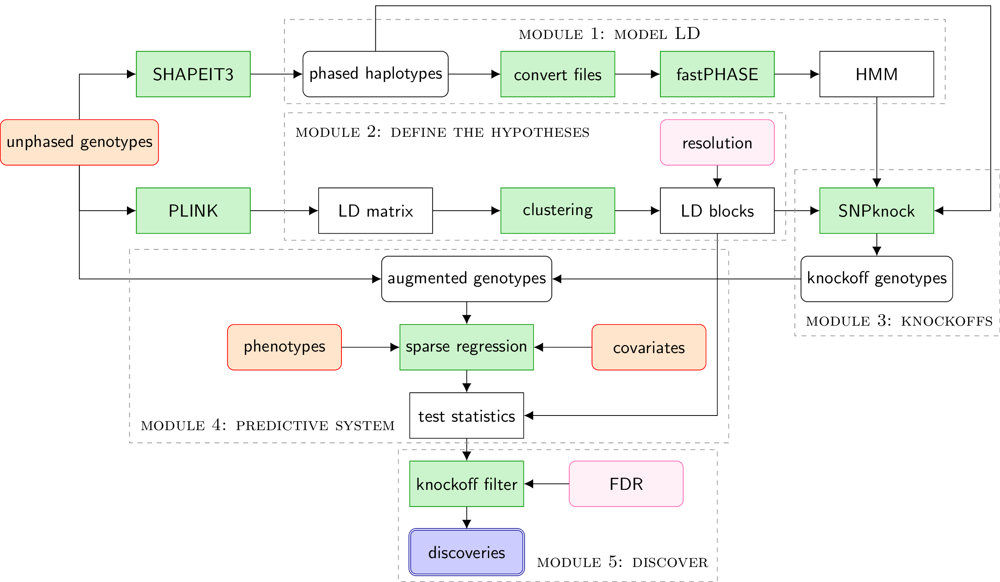

KnockoffZoom is a powerful and versatile statistical method for the analysis of genome-wide association data.

## Overview

The goal of *KnockoffZoom* is to identify causal variants for complex traits effectively and precisely through genome-wide fine-mapping, accounting for linkage disequilibrium and provably controlling the false discovery rate.
The results leverage the genetic models used for phasing and are equally valid for quantitative and binary traits.

We partition the genome into contiguous LD blocks and test whether the trait is independent of
the SNPs in any block, conditioning on the others. The resolution of the hypotheses is determined
by the size and homogeneity of the LD blocks, which we choose in advance.
To balance power and resolution, one can consider multiple partitions, starting with a coarse view and successively  refining it. Some of the results obtained at different resolutions for the phenotype "height" in the UK Biobank are visualized below. 

For more information, read the accompanying paper (coming soon).

## Flowchart

The *KnockoffZoom* methodology is divided into different modules, as summarized in the following flowchart.
The code is available from the [GitHub repository](https://github.com/msesia/knockoffzoom), along with a toy dataset and a working example.

