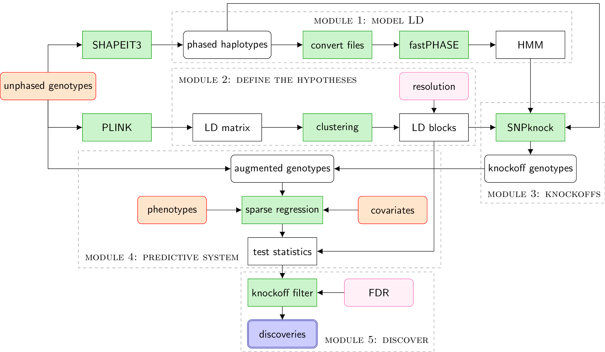

```{r options, echo=F}
knitr::opts_chunk$set(cache=TRUE)
```

## Introduction

In this tutorial, we apply the *KnockoffZoom* method to toy dataset and guide you through each step of the analysis.

### Getting started

First, download *KnockoffZoom* from this (<a href="https://github.com/msesia/knockoffzoom" target="_blank">repository</a>).
The repository includes the core of *KnockoffZoom* and a copy of this notebook that can be easily executed.

Second, ensure that the following software is available and executable.
Note that *KnockoffZoom* is designed for Linux systems.

   - <a href="https://www.cog-genomics.org/plink/1.9/" target="_blank">PLINK 1.9</a>
   - <a href="https://www.cog-genomics.org/plink/2.0/" target="_blank">PLINK 2.0</a> alpha
   - <a href="http://scheet.org/software.html" target="_blank">fastPHASE</a>[]() 1.4.8
   - <a href="https://www.gnu.org/software/datamash/" target="_blank">GNU datamash</a> 1.3
   - <a href="https://github.com/onetrueawk/awk" target="_blank">GNU awk</a> 4.0.2
   - <a href="https://www.gnu.org/software/coreutils/" target="_blank">GNU Core Utilities</a> 8.22

You will also need the following R packages to run *KnockoffZoom*.

   - <a href="https://msesia.github.io/snpknock/" target="_blank">SNPknock</a> 0.8.2
   - <a href="https://CRAN.R-project.org/package=adjclust" target="_blank">adjclust</a> 0.5.6
   - <a href="https://privefl.github.io/bigsnpr/" target="_blank">bigsnpr</a> 0.9.1
   - <a href="https://privefl.github.io/bigstatsr/" target="_blank">bigstatsr</a> 0.8.4
   - <a href="https://doi.org/doi:10.18129/B9.bioc.snpStats" target="_blank">snpStats</a> 1.32
   - <a href="https://CRAN.R-project.org/package=Matrix" target="_blank">Matrix</a> 1.2.15
   - <a href="https://CRAN.R-project.org/package=data.table" target="_blank">data.table</a>  1.12.0
   - <a href="https://www.tidyverse.org/" target="_blank">tidyverse</a> 1.2.1
   - <a href="https://CRAN.R-project.org/package=devtools" target="_blank">devtools</a> 1.13.6

This script will check whether the are available and, if they are not, install them for you.

```{r dependencies-R, message=F}
system("Rscript --vanilla ../knockoffzoom/utils/check_packages.R")
```

Finally, this notebook requires a few packages in addition to the *KnockoffZoom* core.
```{r, message=FALSE}
library(tidyverse)
library(gridExtra)
library(latex2exp)
library(kableExtra)
library(ggdendro)
```

### The data

The toy dataset provided with *KnockoffZoom* contains 1000 artificial samples typed at 2000 loci.
These loci are divided equally between chromosomes 21 and 22.

```{r}
chr.min <- 21
chr.max <- 22
chr.list <- seq(chr.min, chr.max)
```

The genetic data are stored in the standard "BED/BIM/FAM" format, while the phased haplotypes are encoded in a BGEN 1.3 file.

For completeness, we also provide you with a list of individuals and variants that passed quality control.
However, all individuals and variants passed quality control in this toy dataset.
```{r}
# List of individuals that passed QC
qc.samples <- "../data/qc/samples_qc.txt"
# List of variants that passed QC
qc.variants <- "../data/qc/variants_qc.txt"
```

The phenotypes are saved in a tab-separated text file that also contains information on the sex of the subjects.

```{r}
# Phenotype file
pheno.file <- "../data/phenotypes/phenotypes.tab"
# Phenotype name
pheno.name <- "y"
```

Out of curiosity, let's take a quick look at the distribution of the phenotypes.
```{r phenotypes, fig.width=6, fig.height=3.5, fig.align="center"}
phenotypes <- read_tsv(pheno.file, col_types=cols())
phenotypes %>% mutate(sex=as.factor(sex)) %>%
  ggplot(aes(x=sex, y=y)) + geom_boxplot() + theme_bw()
```

The complete list of genetic variants can be inspected as follows. 
```{r genotypes}
# Load list of variants in the dataset
Variants <- lapply(chr.list, function(chr) {
  bim.file <- sprintf("../data/genotypes/example_chr%d.bim", chr)
  bim.colnames <- c("CHR", "SNP", "X0", "BP", "X1", "X2")
  read_delim(bim.file, delim="\t", col_names=bim.colnames, col_types=cols()) %>%
    select(CHR, SNP, BP)
})
Variants <- do.call("rbind", Variants)
# Keep only variants that passed QC
variants.qc <- read_delim(qc.variants, delim=" ", col_names=c("SNP"), col_types=cols())
Variants <- inner_join(Variants, variants.qc, by = "SNP")
```

```{r genotypes-preview, echo=F}
Variants
```


### Preparing for *KnockoffZoom*

Before we apply *KnockoffZoom*, let's create temporary directories to store the final results and the intermediate processed information. 
```{r}
tmp.dir <- "tmp"
dir.create(tmp.dir, showWarnings = FALSE)
res.dir <- "results"
dir.create(res.dir, showWarnings = FALSE)
```

## Flowchart

The *KnockoffZoom* method is organized in 5 modules, as summarized by the flowchart below.
In the following, we will apply it step-by-step to the analysis of the above toy dataset.

<p style="text-align:center;">

</p>

## Module 1

With the first module *KnockoffZoom*, we recode the phased haplotypes into the correct format and feed them to `fastPHASE` to fit an HMM.

### Haplotype conversion

```{r convert-haplotypes}
bgen.to.inp <- function(bgen.basename, chr, qc.samples, qc.variants, inp.basename) {
  # Convert BGEN to transposed HAPS
  cmd <- "../knockoffzoom/utils/bgen_to_hapst.sh"
  cmd.args <- sprintf("%s -i %s -c %s -n %s -v %s -b 500 -o %s",
                      cmd, bgen.basename, chr, qc.samples, qc.variants, inp.basename)
  system(cmd.args)
  # Convert Transposed HAPS to INP
  cmd <- "../knockoffzoom/utils/hapst_to_inp.sh"
  cmd.args <- sprintf("%s -i %s -o %s",
                      cmd, inp.basename, inp.basename)
  system(cmd.args)
}

for(chr in chr.list) {
  # Basename for the input haplotype files (BGEN format)
  bgen.basename <- sprintf("../data/haplotypes/example_chr%d", chr)
  # Basename for output haplotype file
  inp.basename <- sprintf("%s/example_chr%d", tmp.dir, chr)
  # Convert haplotypes into INP file
  bgen.to.inp(bgen.basename, chr, qc.samples, qc.variants, inp.basename)
}
```

### HMM fitting

```{r fit-hmm}
fit.hmm <- function(inp.file, hmm.basename) {
  cmd <- "fastphase"
  fp.k    <- 50      # Number of haplotype motifs
  fp.it   <- 15      # Number of EM iterations
  fp.seed <- 1234    # Random seed
  cmd.args <- sprintf("%s -Pp -T1 -K%d -g -H-4 -B -C%d -S%d -o%s %s",
                      cmd, fp.k, fp.it, fp.seed, hmm.basename, inp.file)
  system(cmd.args)
}

for(chr in chr.list) {
  # Name of input haplotype file
  inp.file <- sprintf("%s/example_chr%d.inp", tmp.dir, chr)
  # Basename for hmm file
  hmm.basename <- sprintf("%s/example_chr%d", tmp.dir, chr)
  # Fit HMM
  fit.hmm(inp.file, hmm.basename)
}
```

## Module 2

With the second module *KnockoffZoom*, we partition the genome into LD blocks to define the hypotheses tested in our multi-resolution analysis.
In this example, we use the following 5 levels of resolution. 

```{r}
resolution.list <- c(2, 5, 10, 20, 50)
```

These numerical values describe each resolution as the number of LD blocks, as a percentage of the total number of available SNPS.
Therefore, at the highest resolution each LD block contains on average 2 SNPs.

### LD clustering

We begin by applying adjacency-constrained clustering to each chromosome, using the $r^2$ coefficients computed with PLINK as a similarity measure between the SNPs.

```{r LD-cluster}
cluster.ld <- function(geno.basename, geno.bim, qc.variants, dendro.file) {
  # Basename for LD table computed by PLINK
  ld.basename <- sprintf("%s/example_chr%d", tmp.dir, chr)
  # LD table computed by PLINK
  ld.file <- sprintf("%s.ld", ld.basename)
  # Compute LD matrix with PLINK
  cmd <- sprintf("plink --bfile %s --keep %s --extract %s --r2 dprime --freq --ld-window 1000 --ld-window-kb 1000 --ld-window-r2 0.01 --out %s",
                 geno.basename, qc.samples, qc.variants, ld.basename)
  system(cmd)
  # Compute dendrogram with adjacency-constrained clustering
  cmd <- "Rscript --vanilla ../knockoffzoom/utils/cluster.R"
  cmd.args <- sprintf("%s %s %s %s %s",
                      cmd, ld.file, geno.bim, qc.variants, dendro.file)
  system(cmd.args)
}

for(chr in chr.list) {
  # Basename for the input genotype files (PLINK format)
  geno.basename <- sprintf("../data/genotypes/example_chr%d", chr)
  # Basename for the input genotype files (PLINK format)
  geno.bim <- sprintf("%s.bim", geno.basename)
  # Dendrogram file
  dendro.file <- sprintf("%s/example_chr%d.RData", tmp.dir, chr)
  # Cluster the genome
  cluster.ld(geno.basename, geno.bim, qc.variants, dendro.file)
}
```

### Visualizing the dendrogram

As an illustration, the clustering computed above can be visualized in the following dendrogram.

```{r visualize-dendrogram, message=F, warning=F, fig.width=7, fig.height=3, fig.align="center", results="hide", eval=F}
chr <- chr.list[1]
# Load dendrogram
dendro.file <- sprintf("%s/example_chr%d.RData", tmp.dir, chr)
load(dendro.file)
# Convert dendrogram for plotting
library(adjclust)
pdf(file = NULL)
hclust.fit <- plot(Sigma.clust,mode="corrected")
dev.off()
unloadNamespace("adjclust")
# Plot dendrogram
dendro <- dendro_data(hclust.fit)
dendro.data <- segment(dendro) %>% as_tibble

dendro.data %>%
  ggplot() +
  geom_segment(aes(x=x, y=y, xend=xend, yend=yend), alpha=0.9, size=0.2) +
  ylab("") + xlab("") +
  theme_bw() +
  theme(axis.text.y=element_blank(), axis.ticks.y=element_blank())
```

### Partitioning

The LD blocks at different resolutions are obtained by cutting the dendrogram at different heights.

```{r partition}
partition.ld <- function(dendro.file, geno.bim, qc.variants, resolution, blocks.basename) {
  cmd <- "Rscript --vanilla ../knockoffzoom/utils/partition.R"
  cmd.args <- sprintf("%s %s %s %s %s %s",
                      cmd, dendro.file, geno.bim, qc.variants, resolution, blocks.basename)
  system(cmd.args)
}

for(chr in chr.list) {
  # Dendrogram file
  dendro.file <- sprintf("%s/example_chr%d.RData", tmp.dir, chr)
  # Basename for the input genotype files (PLINK format)
  geno.bim <- sprintf("../data/genotypes/example_chr%d.bim", chr)
  for(resolution in resolution.list) {
    # Basename for list of blocks at this resolution
    blocks.basename <- sprintf("%s/example_chr%d", tmp.dir, chr)
    # Partition the genome
    partition.ld(dendro.file, geno.bim, qc.variants, resolution, blocks.basename)
  }
}
```

### Summary of the LD blocks

The average number of SNPs and width (in Mb) of the LD blocks at each resolution are summarized below.

```{r LD-summary}
blocks <- lapply(resolution.list, function(resolution) {
  blocks.file <- sprintf("%s/example_chr%d_groups%s.txt", tmp.dir, chr, resolution)
  blocks.res <- read_delim(blocks.file, delim=" ", col_types=cols()) %>%
    mutate(Resolution=factor(resolution, levels=resolution.list, labels=resolution.list))
})
blocks <- do.call("rbind", blocks)
blocks %>% 
  group_by(Resolution, Group) %>%
  summarise(Size=n(), BP.min=min(BP), BP.max=max(BP)) %>%
  mutate(Width=round((BP.max-BP.min)/1e6,3)) %>%
  group_by(Resolution) %>%
  summarise(`Width (Mb)`=mean(Width), `Size (SNPs)`=mean(Size)) %>%
  kable(align='ccc') %>%
  kable_styling(bootstrap_options = c("striped", "hover", "condensed"), full_width = F)
```

We can also look at the distribution of block sizes at any particular resolution.

```{r LD-group-sizes, warning=F, fig.width=5, fig.height=3, fig.align="center"}
blocks.res <- blocks %>% 
  filter(Resolution=="10") %>%
  group_by(Group) %>%
  summarise(Size=n())
blocks.res %>% ggplot(aes(x=Size)) +
  geom_histogram(bins=20) + 
  xlim(0,50) +
  xlab("Block size (SNPs)") +
  theme_bw()
```

## Module 3

With the third module *KnockoffZoom*, we generate knockoffs to test the multi-resolution hypotheses defined above.

### Knockoff generation

```{r knockoff-generation}
generate.knockoffs <- function(hmm.basename, inp.basename, blocks.file, knockoffs.basename) {
  # Generate knockoffs (PED file)
  cmd <- "Rscript --vanilla ../knockoffzoom/utils/knockoffs.R"
  cmd.args <- sprintf("%s %s %s %s %s",
                      cmd, hmm.basename, inp.basename, blocks.file, knockoffs.basename)
  system(cmd.args)
  # Sample information file
  sample.file <- sprintf("%s/example_chr%d.sample", tmp.dir, chr)
  # Convert knockoffs to BED file
  cmd <- "../knockoffzoom/utils/package_knockoffs.sh"
  cmd.args <- sprintf("%s %s %s", cmd, knockoffs.basename, sample.file)
  system(cmd.args)
}

for(chr in chr.list) {
  # Name of input haplotype file
  inp.basename <- sprintf("%s/example_chr%d", tmp.dir, chr)
  # Basename for hmm file
  hmm.basename <- sprintf("%s/example_chr%d", tmp.dir, chr)
  for(resolution in resolution.list) {
    # Basename for list of blocks at this resolution
    blocks.file <- sprintf("%s/example_chr%d_groups%s.txt", tmp.dir, chr, resolution)
    # Basename for knockoffs at this resolution
    knockoffs.basename <- sprintf("%s/example_chr%d_res%s", tmp.dir, chr, resolution)
    # Generate the knockoffs
    generate.knockoffs(hmm.basename, inp.basename, blocks.file, knockoffs.basename)
  }
}
```

### Knockoff diagnostics

Let's verify whether the knockoffs that we have generated are indeed exchangeable with genotypes.
Since the sample size is relatively small in this example, we expect to see some noise in the following goodness-of-fit diagnostics.

```{r knockoff-diagnostics-def}
source("../knockoffzoom/utils/knockoffs_gof.R")

diagnose.knockoffs <- function(chr, resolution) {
  # Basename for knockoffs at this resolution
  knockoffs.basename <- sprintf("%s/example_chr%d_res%s", tmp.dir, chr, resolution)
  # Basename for knockoffs diagnostics
  diagnostics.basename <- sprintf("%s/example_chr%d_res%s", tmp.dir, chr, resolution)
  # Knockoff key file
  key.file <- sprintf("%s/example_chr%d_res%s.key", tmp.dir, chr, resolution)
  # Basename for list of blocks at this resolution
  blocks.file <- sprintf("%s/example_chr%d_groups%s.txt", tmp.dir, chr, resolution)
  # Compare LD matrix and frequencies with PLINK
  cmd <- sprintf("plink --bfile %s --r2 --freq --ld-window 100 --ld-window-kb 1000 --ld-window-r2 0.01 --memory 1000 --out %s",
                 knockoffs.basename, diagnostics.basename)
  system(cmd)
  # Basename for plots
  plot.basename <- sprintf("%s/example_chr%d_res%s", res.dir, 21, 10)
  # Plot knockoff diagnostics
  pp <- plot.knockoff.diagnostics(diagnostics.basename, key.file, blocks.file, plot.basename)
}
```

```{r knockoff-diagnostics, fig.width=6, fig.height=6, fig.align="center"}
# Compute diagnostics with PLINK and plot them
diagnose.knockoffs(21, 10)
```

## Module 4

With the fourth module *KnockoffZoom*, we compute feature importance statistics for the genotypes and their knockoffs, by fitting a multivariate predictive model of the trait. In this example, we use sparse linear regression with cross-validation. Then, we compute test statistics for each LD block, resolution-by-resolution.

### Memory mapping

We adopt an efficient implementation of sparse linear regression that is suitable for very large datasets that do not fit in memory. Therefore, we first convert the genotypes and the knockoffs into a memory-mapped file (file-backed matrix, FBM) that we will later be able to process efficiently.

```{r make-FBM}
make.fbm <- function(gen.basename, fbm.basename, resolution) {
  # Augment genotypes with knockoffs
  cmd <- "../knockoffzoom/utils/augment_genotypes.sh"
  cmd.args <- sprintf("%s %s %s %s %s %s",
                      cmd, gen.basename, fbm.basename, resolution, chr.min, chr.max)
  system(cmd.args)
  # Convert augmented BED to FBM
  cmd <- "Rscript --vanilla ../knockoffzoom/utils/make_FBM.R"
  cmd.args <- sprintf("%s %s %s", cmd, fbm.basename, fbm.basename)
  system(cmd.args)

}

for(resolution in resolution.list) {
  # Basename for output FBM
  fbm.basename <- sprintf("%s/example_res%s", tmp.dir, resolution)
  # Basename for knockoff-augmented genotype files
  gen.basename <- sprintf("%s/example", tmp.dir)
  # Merge the augmented data from all chromosomes and make FBM
  make.fbm(gen.basename, fbm.basename, resolution)
}
```

### Computing test statistics

Now we fit the sparse regression model, tuning the regularization penalty by cross-validation, and compute the test statistics.

```{r test-stats}
compute.stats <- function(fbm.file, key.basename, pheno.file, pheno.name, stats.basename) {
  cmd <- "Rscript --vanilla ../knockoffzoom/utils/lasso.R"
  cmd.args <- sprintf("%s %s %s %s %s %s",
                      cmd, fbm.file, key.basename, pheno.file, pheno.name, stats.basename)
  system(cmd.args)
}

for(resolution in resolution.list) {
  # Basename for output FBM
  fbm.file <- sprintf("%s/example_res%s.rds", tmp.dir, resolution)
  # Knockoff key basename (wildcard ? for chromosome number)
  key.basename <- sprintf("%s/example_chr?_res%s.key", tmp.dir, resolution)
  # Basename for statistics file
  stats.basename <- sprintf("%s/example_res%s", tmp.dir, resolution)
  # Compute test statistics
  compute.stats(fbm.file, key.basename, pheno.file, pheno.name, stats.basename)
}
```

## Module 5

### Filtering the test statistics

The significance threshold for the test statistics is calibrated by the knockoff filter. 
By default, in this example the nominal FDR level is 0.1. The discoveries made at each resolution will be saved in the "results" sub-directory.

```{r filter-stats}
filter.stats <- function(stats.basename, blocks.basename, results.basename) {
  cmd <- "Rscript --vanilla ../knockoffzoom/utils/filter_stats.R"
  cmd.args <- sprintf("%s %s %s %s", cmd, stats.basename, blocks.basename, results.basename)
  system(cmd.args)
}
for(resolution in resolution.list) {
  # Basename for statistics file
  stats.basename <- sprintf("%s/example_res%s", tmp.dir, resolution)
  # Basename for list of blocks at this resolution (wildcard ? for chromosome number)
  blocks.basename <- sprintf("%s/example_chr?_groups%s.txt", tmp.dir, resolution)
  # Basename for results file
  results.basename <- sprintf("%s/example_res%s", res.dir, resolution)
  # Filter stats and report discoveries
  filter.stats(stats.basename, blocks.basename, results.basename)
}
```

## Results

### Summary of discoveries

The numbers of distinct discoveries reported at each resolution as listed below.

```{r discoveries-summary}
discoveries <- lapply(resolution.list, function(resolution) {
  discoveries.file <- sprintf("%s/example_res%s_discoveries.txt", res.dir, resolution)
  discoveries.res <- read_delim(discoveries.file, delim=" ", col_types=cols()) %>%
    mutate(Resolution=factor(resolution, levels=resolution.list, labels=resolution.list))
})
discoveries <- do.call("rbind", discoveries)
discoveries %>% 
  complete(Resolution) %>% 
  group_by(Resolution) %>% 
  summarise(Discoveries=sum(!is.na(Group))) %>%
  kable(align='cc') %>%
  kable_styling(bootstrap_options = c("striped", "hover", "condensed"), full_width = F)
```

### Visualizing the discoveries

The discoveries can be visualized interactively with our Shiny app.
Two examples are provided here.

```{r visualize-discoveries-setup}
source("../visualization/utils_clumping.R")
source("../visualization/utils_plotting.R")
source("../visualization/utils_shiny.R")
# Download the gene and variant annotations if they are not available
cmd <- "cd ../misc; ./download_annotations.sh; cd ../notebooks"
system(cmd)
# Load gene and variant annotations
annotations <- load_annotations("../data")
# Location of LMM p-values
lmm.dir <- "../data/lmm"
# Load results
results <- load_association_results(res.dir, lmm.dir, "example")
```

```{r visualize-discoveries, warning=F, fig.width=14, fig.height=10, fig.align="center"}
window.chr <- 21
window.boundaries <- find_chr_boundaries(results, window.chr)
window.left <- window.boundaries$min.BP
window.right <- window.boundaries$max.BP
plot_combined(window.chr, window.left, window.right,
              results$Discoveries,
              results$LMM,
              results$LMM.clumped,
              Annotations.func=annotations$Annotations.func,
              Exons.canonical=annotations$Exons.canonical)
```

```{r visualize-discoveries-2, warning=F, fig.width=14, fig.height=10, fig.align="center"}
window.chr <- 21
window.center <- 14.9
window.width <- 0.2
window.left <- (window.center-window.width/2)*1e6
window.right <- (window.center+window.width/2)*1e6
plot_combined(window.chr, window.left, window.right,
              results$Discoveries,
              results$LMM,
              results$LMM.clumped,
              Annotations.func=annotations$Annotations.func,
              Exons.canonical=annotations$Exons.canonical)
```